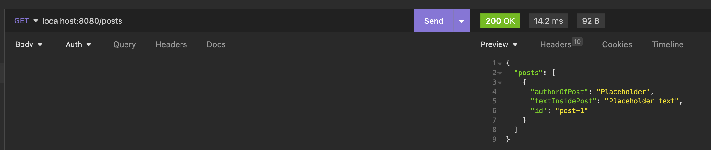
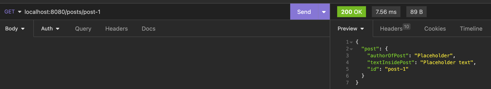
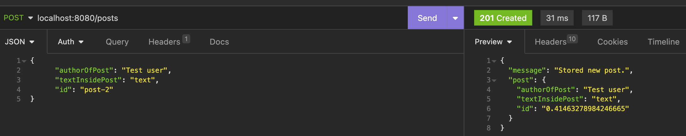

# **React MessageBoard API**

## <ins>Summary</ins>

This is a API built using Express.JS as the back-end piece for my React Messageboard project.

The purpose of this is to provide data storage capabilities for created posts and handle fetching operations for both individual posts and all posts.

---

## <ins>Tech Stack</ins>

- Express.js

---

## <ins>Endpoints</ins>

- GET: /posts
- GET: /posts/:id
- POST: /posts

---

## <ins>Local Setup</ins>

1. To clone the repo, open up your terminal and run `git clone https://github.com/mandeep-s1ngh/react-messageboard-api.git` - once you have it cloned, move the folder to your usual directory for projects (if necessary).

2. You can then open up the folder in your code editor of choice and run `npm install` to all the dependencies.

3. Then run `npm start` or `node app.js`. This will start the app and keep it running in the background.

4. You can then run the Messageboard project in tandem to create posts, view a single post and see all posts via the front end. All the posts are stored in the posts.json file of this repo. There is already one post to begin with to get you started.

**Note** - The app listens on port 8080. You can also download and use [Insomnia](https://insomnia.rest/) or something similar to make requests to the endpoints.

---

## <ins>Screenshots</ins>

